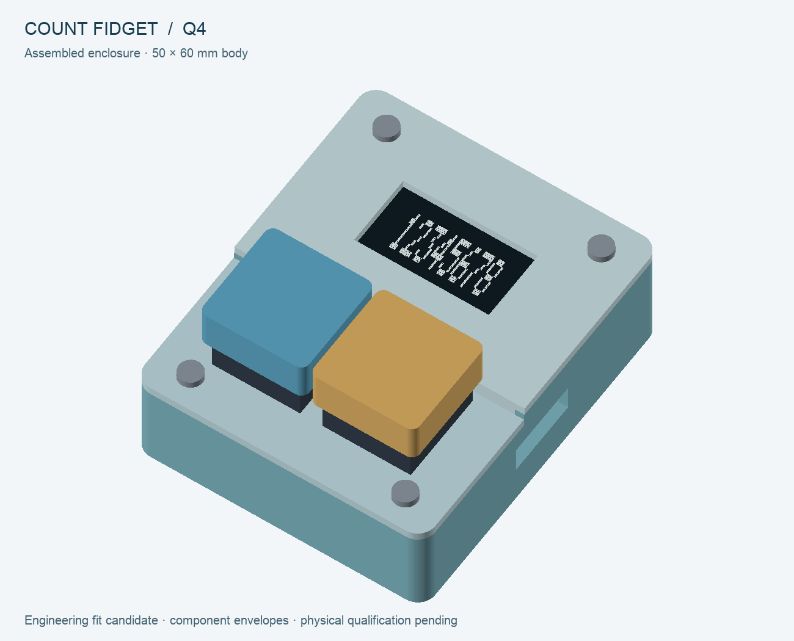

# Q4 engineering review — 24 September 2026

## Review scope

The user selected product quality, simple integration and straightforward home programming over small component-price differences. Q4 implements **STM32L072CBT6**, a **complete HS96L01W4S03 SPI OLED module**, **FM25V02A SPI FRAM**, a common regulated supply and a **two-layer 42 × 54 mm board**. The factory ROM supports the intended USB-C programming/recovery workflow; no application bootloader or USB-to-UART adapter is required by this design.

The PCB contains **86 references: 70 fitted parts and 16 test/mounting features**. The factory split is **67 bottom-side SMT placements**. The module and two keys are separately sourced for authorized home through-hole completion, using a separately accounted seven-pin header. The exact 38 fitted MPNs have positive timestamped JLC stock observations; loose module, keys and header also have separate retail stock evidence. Inventory is unreserved and does not establish assembler process acceptance.

Q1/Q2/Q3 and their submitted/frozen archives remain unchanged. **Quoting, uploads, draft changes, vendor messages, purchases and manufacture remain paused.** This is an engineering review candidate, not an approved order or a physical qualification report.

## Decisions and rationale

- **STM32 instead of MSP430/ESP32/ATtiny:** combines low-power operation with built-in USB recovery and enough pins for separate display and memory buses. The alternatives are recorded in the [options study](mcu-options-2026-09-23.md).
- **Complete SPI display module:** removes bare-FPC assembly, the separate panel converter/inductor and the prior I²C electrical-margin problem. The module drawing controls its 27.30 × 27.80 mm geometry and SSD1315 identity where summary prose conflicts.
- **External FRAM:** separates count records from application updates and avoids EEPROM wear and write-stall concerns. An isolated RC supply and open-drain chip select address the chosen memory's power-ramp/interface requirements conditionally; physical measurements remain necessary.
- **Common 3.20481 V nominal supply:** powers all MCU domains together and supports module logic/USB limits with margin in the regulated corner calculation. TLV767's quiescent current is a documented battery-life cost of the chosen straightforward circuit. Low-headroom, very-light-load and dynamic behavior are not guaranteed by the calculation.
- **Two copper layers:** sufficient for the routed design. Four layers were not a product requirement. Extra complexity is retained only where it serves charging, protection, thermal independence, retained count or recoverable programming.
- **Four-screw enclosure:** two front mounts support the PCB and retain a vertically removable display cover. The rear key plate is fitted before key soldering. Home completion is eighteen solder joints; exact pack, keycaps and physical process remain separate.

## Independent review findings and fixes

The reviews examined exact package pin assignments, power and SPI contracts, native footprint geometry, firmware fault behavior, enclosure assembly and routing. Findings were resolved in the coordinated Q4 sources:

- Corrected the module's drawing dimensions and header position, selected a separate stocked header and provided space for clipped solder tails.
- Replaced a marginal preliminary supply divider/regulator choice with the reviewed TLV767/precision-divider circuit and conservative display voltage guard.
- Added local USB protection bypassing; removed an unnecessary VBUS detection divider that could inject current during reset/unpowered conditions.
- Added a warm-reset FRAM wake guard, bounded ADC fault shutdown and explicit OLED high-impedance power-off sequencing.
- Corrected front-cover retention and PCB support; moved a resistor away from the display solder envelope and a keeper screw away from the reset switch.
- The independent firmware audit identified STM32 revision-A Stop-entry erratum ES0292 §2.1.2 and a permanent-storage-failure sleep loop. Both are fixed: the complete 56-byte Stop routine and its literals are copied to aligned SRAM, its actual instructions are checked, and a quiescent storage fault can sleep while retaining ERR and committed-count truth. An independent reviewer verified the source, compiled sequence and failure reproducer.
- The verifier review added explicit NC-contract checking, rejection of extra board-outline geometry, saved-status checks and complete routing-source hash coverage. All 42 corruption tests rejected the intended bad inputs after first requiring a clean real native baseline.

## Validation record

**The coordinated final engineering checks passed.** Fresh KiCad10.0.6 reports zero ERC violations, zero DRC violations, zero unconnected items and zero schematic parity issues. No electrical or courtyard exception is accepted. Native semantics match all 86 references, 243 connected physical pins and 29 explicit NC pins. The earlier schematic-generation checkpoint retains its original input metadata and points to this final native binding; it does not claim another generator run.

| Scope | Evidence |
|---|---|
| Native circuit, physical pins, local land geometry, placement, fields and routing | [Final native binding](../verification/q4-validation.json), fresh ERC/DRC and native XML; independent routing review |
| Deliberate verifier corruption rejection | [42 rejected mutations](../verification/q4-negative-tests.json); clean baseline verified before and after |
| Target build, RAM routine and loaded-image agreement | [Build manifest](../firmware/q4-stm32/build/build-manifest.json); 8,001 loaded bytes / 2,416 static RAM bytes; 13 image/protocol corruptions rejected |
| Portable firmware behavior, corruption and reproducibility | [Full tests](../verification/q4-firmware-tests.json), [UBSan](../verification/q4-firmware-sanitized-tests.json), [two identical clean builds](../verification/q4-firmware-reproduction.json) |
| Conditional electrical corners and ideal ngspice subcircuits | [64 rail corners and three negative cases](../simulation/q4-power/result.json); [ngspice45.2 analytical agreement](../simulation/q4-power/spice-result.json); cold-insertion bound remains false |
| Enclosure solids, meshes, static and assembly-path intersections | [Fit report](../mechanical/q4/fit-report.json): four valid/manifold bed-aligned print parts; zero modeled collisions; 162 poses / 33,534 sampled path tests; images inspected |
| Exact inventory and assembly split | [Stock evidence](../procurement/q4/inventory.md), [25 validated local outputs](../procurement/q4/export-manifest-Q4.json); 67 SMT BOM/CPL rows, 70 native placements, separate home/offboard lists |

The full firmware suite includes 1,179,648 torn-word reboots, 256 record-bit corruptions, 7,072 button waveforms, 2,295 queue/storage schedules, 200 recovery interleavings, eight fault-idle scenarios, FRAM/OLED transport faults and 1,527,742 bounded voltage-policy cases. These are declared software models, not MCU peripheral or analog-board execution. UBSan uses a smaller representative tear sweep; AddressSanitizer was unavailable and is not reported as passed.

Final PCB SHA-256 is `2b073a519171d1632d67138ff7be2bf7271f6a5f8a328d8e9e5b5cff7cc47780`. Final firmware ELF SHA-256 is `9a982e4322120769f108ffac44afaba64b9b09f7f665c50e08c2f34d6745a097`. The local Gerber ZIP has 12 native members, 106,007 bytes, SHA-256 `64c5d51c2831c90eb6d7dbda017c0a23288b2583559978ec1ad858991bbfc873`. No Q4 RFQ was submitted.

## Physical gates before an order can be released

1. **USB and target execution:** enumerate/program/recover through both cable orientations, verify options and interrupted-download recovery, execute sleep/wake on actual silicon, and confirm the saved count survives application updates.
2. **Supply/interface behavior:** measure common and FRAM rails during startup, sleep, USB plug/unplug, reset, low-cell shutdown and display load steps. Verify regulator dropout recovery/overshoot/reverse current, effective capacitors, MCU supply slopes, FRAM ramp limits and interface injection.
3. **Cell, charger, protection and temperature:** qualify the exact prepared cell/NTC harness, regulation voltage/current, independent thermal inhibit, sensor open/short response, charge temperature and fault recovery. The roughly 30 mA protection intent must accommodate actual permitted loads without exceeding the approved cell's limits.
4. **Battery insertion:** unrestricted cold insertion still has a counterexample exceeding the minimum short-circuit delay. The intended USB-first attachment and USB rearming sequence has conditional supporting analysis but must be demonstrated with the combined real charger/protector and connector. A persistent failure requires circuit revision; instructions cannot waive it.
5. **Count/display reliability:** interrupt actual power during saves, stress simultaneous/bouncing keys and rendering, test persistent storage/peripheral faults and recovery, confirm optical performance, current, low-voltage behavior and measured usable runtime.
6. **Assembly and enclosure:** inspect JLC land/orientation/process acceptance when quoting resumes; verify USB stake wetting, clipped joints, header/module fit, switch plate, supports, wiring, keycaps, screw strength, battery retention and cable strain on a physical first article.

The ideal SPICE deck contains passive/current-source envelopes, not validated models of every IC, cell and module. **No whole-board simulation or physical working-unit proof is claimed.** Native checks, bounded firmware tests and CAD checks support an informed first article; they do not close these measurements or authorize manufacture.
