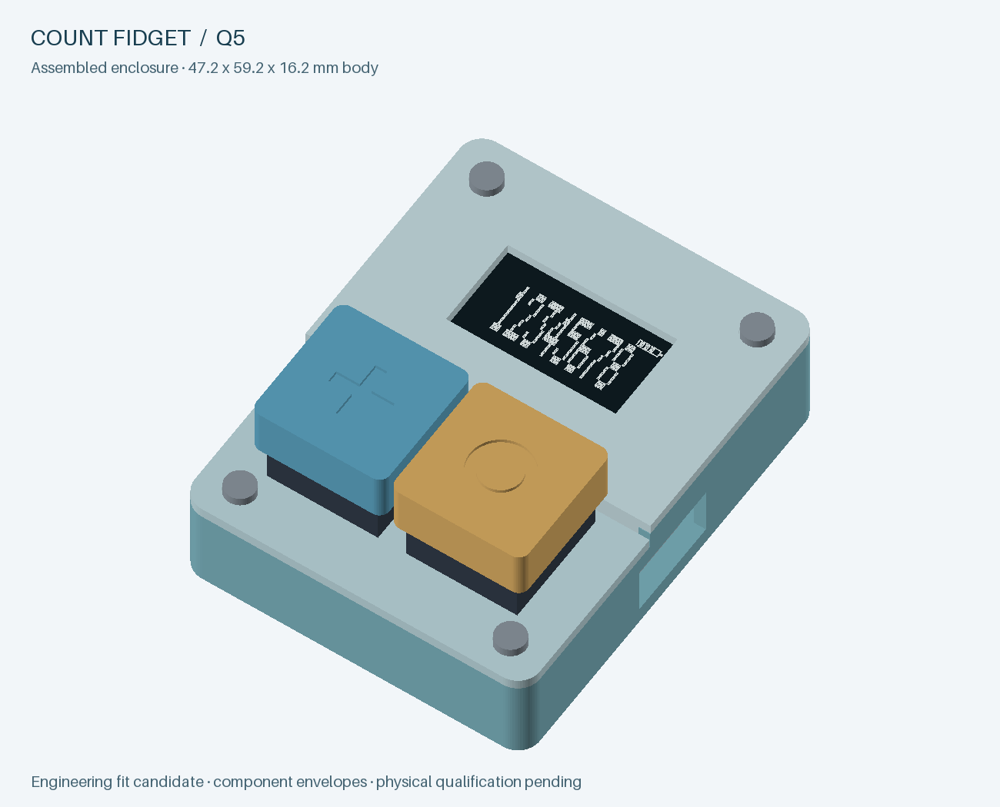

# Q5 engineering review — 25 September 2026

**Start here for Q5.** Q5 is a coordinated revision of the frozen Q4 candidate. It resolves the ten findings filed from the Q4 simulation review ([issues #2–#9, #12, #13](https://github.com/dudgeon/count-fidget/issues?q=is%3Aissue)) and the owner's requests of 25 September:
- soft power on the COUNT key with automatic power-off;
- a battery gauge, low-battery warning and storage cut-off;
- charge status;
- a reachable hardware reset;
- new key logic (increment wins; reset needs a deliberate hold);
- a shrunk enclosure;
- a BOM of JLC inventory parts only.

Q1–Q4 files are unchanged. **The quote pause stays in force:** no uploads, quote-draft changes, vendor messages, purchases or manufacturing release. Everything here is design-file, host-model, emulator and CAD evidence. **Nothing has been built or measured.**

Related documents: [Q5 power design](q5-power-design.md), [Q5 firmware and home programming](q5-firmware.md), [enclosure and assembly](../mechanical/q5/README.md), [build workflow](build-and-verify.md#active-q5-engineering-workflow), [Q4 simulation review that raised the issues](REVIEW-Q4-simulation-2026-09-25.md).

## What Q5 is

- **Unchanged from Q4:**
  - STM32L072CBT6 with ROM USB DFU;
  - FM25V02A SPI FRAM with the same 96-slot journal (a Q4 FRAM image reads unchanged);
  - HS96L01W4S03 SPI OLED module;
  - BQ25185 charger, BQ29700 protector, TLV767 3.2 V rail;
  - two-layer 42 × 54 × 1 mm board and the same four mounting holes.
- **Parts count:** **93 references: 79 fitted (76 vendor SMT + 3 home through-hole) and 14 PCB features**, 41 exact MPNs.
- **Home completion:** unchanged at 18 joints (display header 14 + two keys 4).
- **Offboard items:** reduced to the user-supplied LIR2032 cell.

## Fix order and why

Each fix was placed so that nothing done earlier had to be redone:

1. **Architecture/netlist decisions first** (#12, #13, #8, #5): power latch, cell holder + onboard NTC, battery sense, charger status, QOD. These change pins, so firmware and layout depend on them.
2. **Firmware** against the new pin contract:
   - boot capture gate (#2);
   - key semantics and DFU safety (#3 and the owner's reset rule);
   - option-byte provisioning (#6);
   - responsiveness (#7);
   - power-off, gauge and cut-off (#12, #9.4);
   - PVD wording (#9.1).
3. **Instruction-level emulation** of the actual ELF on a Q5 board model, before any layout work, so behavioural bugs were found cheaply. Four firmware defects were found and fixed here: the mV overflow, the label priority, the USB-during-LO cancel, and release-loop flapping.
4. **PCB placement, routing, ERC/DRC** once the netlist was final.
5. **Enclosure** from the final routed board (#4, pack-bay removal, keycaps, reset pinhole, shrink).
6. **Stock screen and exports** bound to the final model hash.
7. **Documents and issues.**

## Resolution by issue

| Issue | Q5 resolution | Evidence | Remaining physical gate |
|---|---|---|---|
| [#2](https://github.com/dudgeon/count-fidget/issues/2) boot ERR after journal wrap | Button capture starts only after the journal load. Faster boot: FLASH latency 0, CS guard 110 loops, nibble CRC-32 table. | Emulated boot drains the queue at 207 ms with all 96 slots valid; no sample dropped; host CRC equivalence over 20,000 records | Boot timing on silicon |
| [#3](https://github.com/dudgeon/count-fidget/issues/3) DFU entry zeroes count | A reset commits only on **release** after a completed ≥ 2 s hold. A key held at MCU start is a level, not a press. On battery, NRST is a power cycle. | Emulator D1–D4 preserve the count in both DFU entry orders | Real DFU enumeration |
| Owner key rule | Both keys → **increment wins**, and the reset is cancelled. Reset needs a **2 s hold** (RST shown) and a release before 10 s. | 826 host key-hold cases; emulator K2, K3, K5–K7 | Contact bounce on real switches |
| [#4](https://github.com/dudgeon/count-fidget/issues/4) USB plug can't mate | 13.4 × 7.2 mm opening on the receptacle axis, cut through to the receptacle face; checked against a USB-IF maximum overmold | Fit report: USB mouth 2.0 mm from outer wall, no intersections | Real cables, both orientations |
| [#5](https://github.com/dudgeon/count-fidget/issues/5) 2–3 week battery life | Solved by #12: everything below SYS is off when idle; the regulator is kept | Off current 8.0 µA typ; emulated life 150–169 days on a shelf, 81–91 light, 42–48 moderate, 14–16 heavy | Measured off current and runtime |
| [#6](https://github.com/dudgeon/count-fidget/issues/6) blank board with factory option bytes | Firmware programs USER 0x807C once (BOR_LEV 0xC only; never RDP) and reloads. Any other mismatch shows **OPT**. | Emulator O1 (factory 0x8070 → provision → counts), O2 (OPT) | Option programming on silicon |
| [#7](https://github.com/dudgeon/count-fidget/issues/7) slow display | First frame in GDDRAM before AFh; partial redraw; 31-byte packets; no-divide glyph renderer; module powered during the journal scan | Press to digits 60–66 ms (Q4 200–225); USB Stop wake 0.34 s (Q4 0.77); off → lit 0.45 s | Optical response |
| [#8](https://github.com/dudgeon/count-fidget/issues/8) OLED supply | U6 QOD unconnected (SSD1315 §6.9.2). The display now runs only on a regulated ≥ 3.151 V rail because the 3.35 V cut-off precedes dropout. The supply choice is explained in the power document. | Netlist/ERC; emulator hard-reset cases note the floating supply | Module power tree, VBAT/pump/current, 200 × NRST |
| [#9](https://github.com/dudgeon/count-fidget/issues/9) minor findings | (1) PVD5 documented as best-effort only. (2) USB-first insertion cited to SLUSBU9I §8.4.1 in docs and assembly. (3) Cold-insertion counterexample retained; the latch keeps SYS_LOAD off at insertion. (4) **LO** label plus a 3.35 V cut-off, so there is no blind counting. | Emulator L1–L4; `simulation/q5-power` | Insertion on real cells; first-connection behaviour |
| [#12](https://github.com/dudgeon/count-fidget/issues/12) soft power | COUNT/SW1 switches SYS onto U7 ON; PB2 holds it; VBUS holds it via D4. The power-on press counts. 30 s auto-off on battery; Stop fallback with USB. | Emulator B1–B5, U1–U5, C4, H1/H2; latch press ≥ 20.5 ms typ / 26.2 ms allowance; inrush 12.6 mA < 27.3 mA OCD | Latch timing with a bouncing contact; release behaviour |
| [#13](https://github.com/dudgeon/count-fidget/issues/13) JLC-inventory BOM | Pack/harness → vendor-soldered BT1 holder + onboard TH1. Keycaps printed. U5 moved to TLV7012DDFR (881 stock). All 41 MPNs pass a 10-board + spares screen. | `procurement/q5/stock.json`; offboard CSV = LIR2032 only | Home vs JLC THT cost comparison when quoting resumes |

New in Q5 beyond the issues:
- **Charge status:** CHG while charging, full gauge when done, BAT on fault.
- **4-bar gauge.**
- **Reset pinhole:** a bottom opening reaches SW3 (NRST).

## Key and display behaviour (user-visible summary)

- **COUNT** (+ keycap) adds one; from off it powers on and that press counts. Held keys never repeat.
- **RESET** (○ keycap): hold 2 s until **RST** appears, then release (within 10 s) to zero. Pressing COUNT at any time cancels it.
- **Top-right:** 4-bar battery gauge. **LO** below ~3.55 V; below 3.35 V the count is saved and the board turns off. **CHG** while charging.
- **Auto-off:** 30 s after the last key on battery. With USB, the display sleeps and the MCU stops.
- **Label priority:** OPT > RST > ERR > MAX > LO > CHG/BAT.

## Validation record

| Scope | Evidence |
|---|---|
| Native schematic/PCB | Fresh KiCad 10.0.6: **ERC 0, DRC 0 violations, 0 unconnected, 0 parity**; 93 refs, 264 connected pins, 22 explicit NC pins ([binding](../verification/q5-validation.json)). 1,126 tracks, 118 vias, two GND pours, 31 recorded stitching vias ([gnd-stitch.json](../electronics/q5/gnd-stitch.json)); no same-net via closer than 0.1 mm to a land |
| Verifier corruption rejection | [42 of 42 rejected](../verification/q5-negative-tests.json) after a clean native baseline |
| Target build | Arm GNU 14.3.Rel1; 10,196 loaded bytes, 2,480 static RAM bytes, Bank 1 only, EEPROM and option bytes excluded ([manifest](../firmware/q5-stm32/build/build-manifest.json)); 13 image corruptions rejected ([image checks](../verification/q5-firmware-image-checks.json)) |
| Portable firmware models | [Full suite](../verification/q5-firmware-tests.json): 1,179,648 torn-word reboots, 256 bit corruptions, 7,072 button waveforms, 826 key-hold cases, 2,295 queue/storage schedules, 200 recovery interleavings, 350 FRAM faults, OLED transport faults at 80 positions, 1,527,742 rail corners, 1,301 battery-policy readings. [UBSan run](../verification/q5-firmware-sanitized-tests.json) (gcc; clang's UBSan runtime is not installed here) |
| Instruction-level emulation | 35 scenarios on the final ELF (SHA-256 below), **0 expectation failures** ([results](../simulation/q5-firmware-emulation/results/scenarios.json)); [energy model](../simulation/q5-firmware-emulation/results/energy-model.json) |
| Bounded power calculations | [result.json](../simulation/q5-power/result.json): latch, inrush, off current, ADC separation, cold insertion (counterexample retained), storage |
| Enclosure | [Fit report](../mechanical/q5/fit-report.json): five valid, manifold parts; zero static intersections; 162 poses / 18,063 sampled path tests with zero collisions; renders inspected |
| Stock and exports | 41/41 exact MPNs pass; lowest stock DMN2056U-13 189, HS96L01W4S03 524, TLV7012DDFR 881 (read-only public catalogue, unallocated). 25 exports in [procurement/q5](../procurement/q5/REVIEW-EXPORTS-Q5.md): 76 SMT BOM/CPL rows, 3 home parts, separate header, LIR2032 offboard |

- PCB SHA-256: `e796f5be743cc093f827b137a9b6b9fe90b22e3b3154b0d552f8eb761abdce48`.
- Firmware ELF SHA-256: `9626fb6602e87e05377770453776d5725e06c6492187add5715d2110767d2570`.
- Gerber ZIP: 12 members, 121,878 bytes, SHA-256 `cd593bd0b1c1120dd80f0b392ef8d8dd9e4e250c4ce2a2ad9dfe1020a2985c16`.
- No Q5 RFQ was submitted.

## Physical gates before an order can be released

The Q4 gates still apply: USB/target execution, supply/interface behaviour, charger/protector/temperature, count and display reliability, assembly and enclosure. Q5 adds or changes these:

1. **Power latch:** minimum press to latch with a real bouncing MX contact; clean U7 turn-off on PB2 release; USB unplug during Stop; the NRST power cycle on battery.
2. **Battery sense and status:** ADC accuracy through the 75 kΩ divider source; gauge thresholds against a real LIR2032 discharge under display load; STAT1/STAT2 behaviour in every charger state; measured ~8 µA off current.
3. **Cell and holder:** holder contact resistance and retention; insertion with USB present (BQ2970 first connection); the retained cold-insertion counterexample on real cells; TH1 thermal coupling to the cell.
4. **Display supply (#8):** module power tree; VBAT, pump, readability and current at 3.15–3.26 V; 200 × NRST with the display on.
5. **Enclosure:** real USB-C cables in both orientations; printed keycap cross-socket fit and travel; pinhole access to SW3; load supports; cell replacement.
6. **Process:** BT1 and J1 solder inspection; the home through-hole route (versus JLC THT) cost comparison once quoting resumes.

**No whole-board simulation or physical working unit is claimed.** The evidence above supports building a first article when the owner authorises it. It does not replace these measurements.
