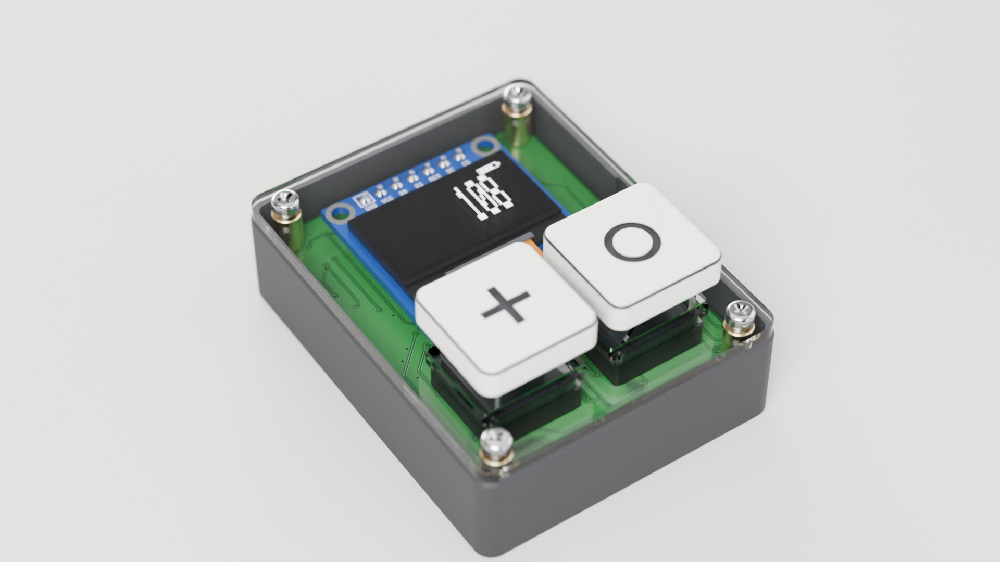
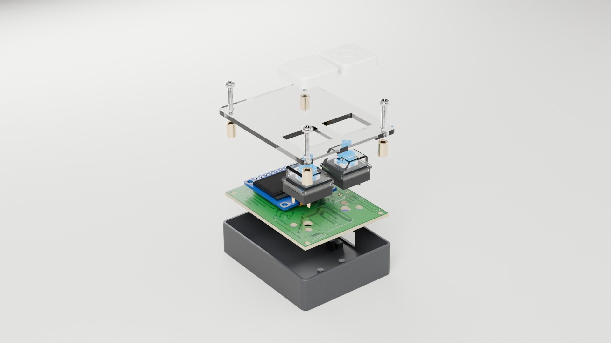
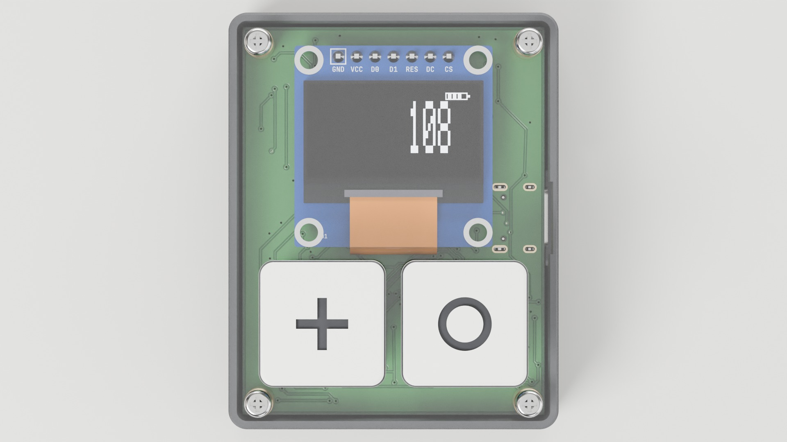
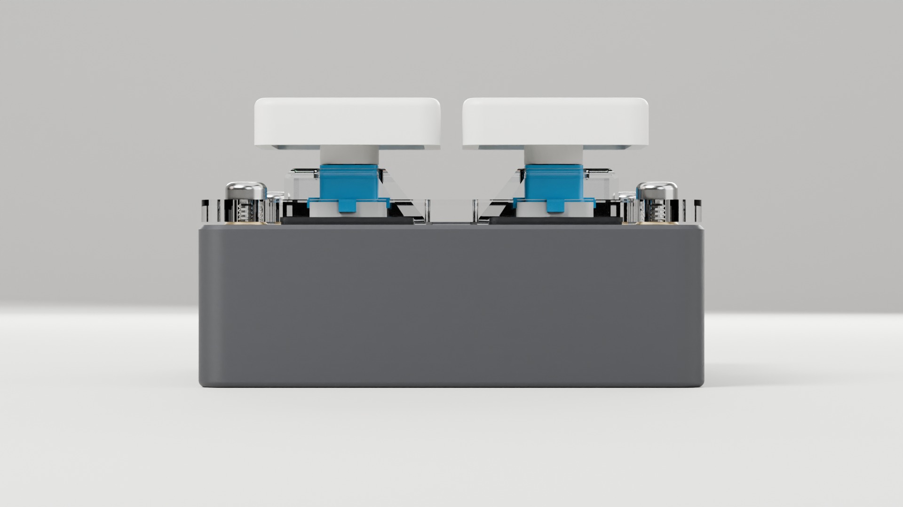
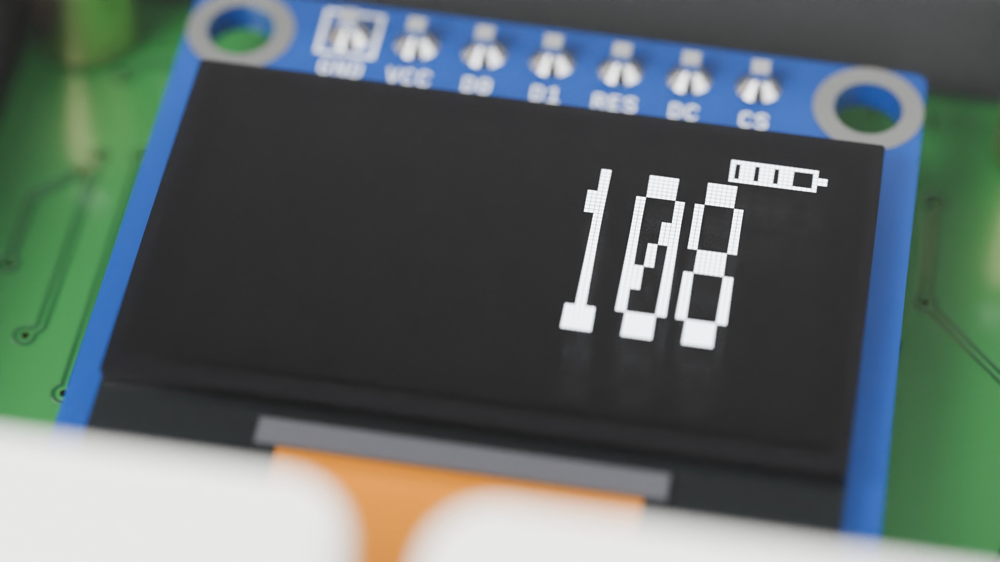
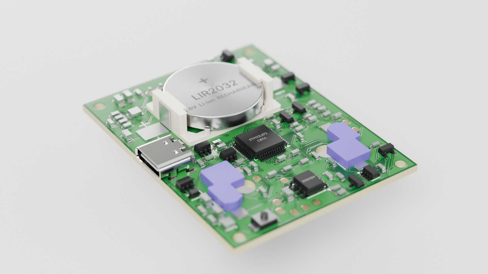
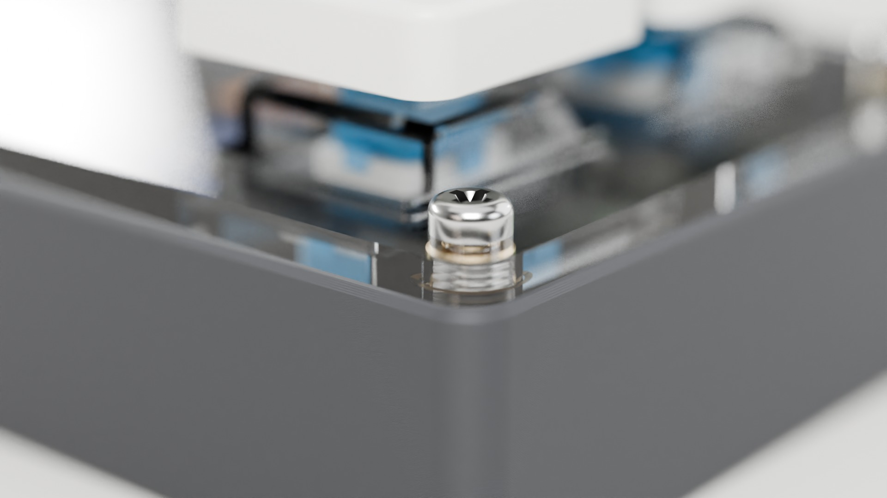
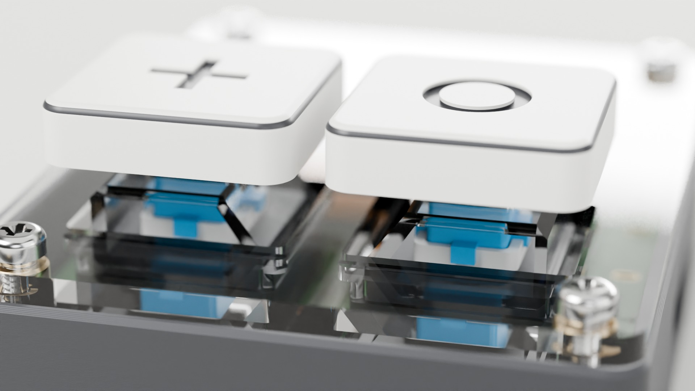

# Q5A — printed tray + clear acrylic lid (alternate enclosure for the ordered Q5 board)

Q5A is an alternate enclosure for the **ordered, locked Q5 board**. It keeps a 3D-printed tray and replaces the Q5 printed front cover and rear key plate with **one flat piece of clear, laser-cut cast acrylic**. The board, its BOM and every Q5 file are unchanged. `mechanical/q5/` remains the checked printed-lid design.

**Body: 45.4 × 57.4 × 16.8 mm (26.2 mm to the key tops).** Q5 was 47.2 × 59.2 × 16.8 mm (26.7 mm). The footprint shrinks by 1.8 mm in each direction. The height does not change, because two features fix the lid height: the display module and the switch rims.

| | |
|---|---|
|  |  |
|  |  |
|  |  |
|  |  |

Also: [white tray](renders/hero-white.jpg), [black tray](renders/hero-black.jpg), [USB-C port](renders/usb.jpg).

Films: [assembly film](video/q5a-assembly-film.mp4) (polished cut) and [assembly explainer](video/q5a-assembly-explainer.mp4) (annotated cut).

## Design decisions

| Decision | Why |
|---|---|
| **Lid underside at PCB top + 6.0 mm**, set by four 6.0 mm spacers | Two independent limits meet here. The checked maximum OLED stack is PCB top + 5.7 mm, leaving the same 0.3 mm air gap as the Q5 front cover. The CPG151101D13 rim top is at 6.00 mm (maker drawing). The acrylic therefore sits on the switch rims as well as on the spacers. |
| **No display cutout** | The OLED reads through the lid with a 0.3–0.9 mm air gap. A cutout saves no height because the switch rims already set the lid height. A cutout would expose the fragile glass edge, chip-on-glass driver and FPC, would need to be module-sized (about 28.5 × 29 mm, since the module PCB rises above a lower lid), would leave a 2.6 mm web next to the key holes and would let dust in. |
| **Key holes 15.2 × 12.9 mm, R0.6**: smaller than the 15.60 × 13.96 mm switch rim, larger than the upper housing | The lid captures each switch: 0.20 mm of rim along the pin axis and 0.53 mm across it (22 mm² per switch). A keycap pull or a knock is taken by the lid, not by the hot-swap socket alone. The hole clears the upper housing by 0.25/0.28 mm. The switches are 3-pin plate-mount parts without PCB pegs, so this retention matters. |
| **Switches press in before the lid**; the lid then slides down over the housings | The upper housing narrows upward, so a vertical lid path clears it. This is checked at 61 poses. |
| **Keycaps: 17 mm printed tiles**, underside at PCB top + 13.1, top at + 17.4 (Q5 stem datum) | The screw heads sit on the lid top next to the keys. At 17 mm the keycap stays 1.41 mm from the rear screw heads in plan. A pressed key (4.4 mm worst-case travel) stays 0.4 mm above the thickest accepted sheet (2.3 mm). The cross socket and 0.65 mm roof clearance are unchanged from Q5. |
| **Tray walls 1.2 mm, PCB gap 0.5 mm, floor 1.2 mm, 0.5 mm under the holder** | This is as small as works: 3 perimeters of a 0.4 mm nozzle, 6 floor layers, and board outline plus print tolerance inside the gap. The inner corners (R1.4) clear the square board corners. |
| **USB relief**: 10 × 0.4 mm pocket in the inner wall above the port | J1's mouth is 0.575 mm proud of the board edge, which is more than the 0.5 mm gap. Without the relief the board cannot drop in straight; the generator's path check found this. The pocket is invisible from outside. |
| **USB opening 13.4 × 7.2 mm, R1.0** (Q5: square corners) | Still passes the USB-IF maximum 12.35 × 6.5 mm overmold envelope. Any radius above 1.13 mm would clip its corners. The mouth is now 1.1 mm behind the outer wall (Q5: 2.0 mm), so plugs seat more easily. |
| **Fasteners: 4 × M2 × 14 cross pan-head self-tapping screws** through the lid (Ø2.4 holes), 6.0 mm spacers and the PCB mounting holes into Ø1.7 mm tray pilots (4.4 mm engagement) | One screw per corner clamps the lid, spacer, board and tray. No threads are cut in acrylic. Heat-set inserts are not used because bottom-side parts limit the tray bosses to Ø4.4 mm, too thin a wall for an M2 insert. The Q5 M2 × 6 screws (C357360) are too short for this stack. |
| **0.25 mm reveal** between the tray rim and the lid, and the lid inset 0.25 mm from the tray outline | The spacers, not the print, set the lid height. The inset makes cut and print tolerance read as a deliberate step. A 0.4 mm chamfer on the rim absorbs misalignment. |

## Could it be smaller?

| Dimension | What sets it | Options and cost |
|---|---|---|
| Width/depth 45.4 × 57.4 | 42 × 54 board + 2 × (0.5 gap + 1.2 wall) | 1.0 mm walls save 0.4 mm but are 2.5 perimeters and weaker around the USB opening. A 0.3 mm gap saves 0.4 mm but needs a tightly calibrated printer. Not recommended. |
| Height to the lid top 16.8 | 1.2 floor + 0.5 + 5.52 holder + 1.6 PCB + 6.0 (OLED/rims) + 2.0 lid | A 1.5 mm (1/16 in) sheet saves 0.5 mm and still passes, but flexes more at the screws. A 1.0 mm floor saves 0.2 mm, with a thinner floor under the cell. |
| Key tops 26.2 | The switch's fixed stem height (PCB top + 15.0) plus 2.4 mm of keycap | Fixed by the switch. The Q5 printed-lid design sits at 26.7 only because of its thicker floor and gap. |

## Laser-cut acrylic — DFM

- **Material: clear cast acrylic (PMMA), 2.0 mm.** Cast rather than extruded: laser-cut cast edges come out flame-polished, and cast sheet carries less residual stress, so it crazes less at screw holes. Cast sheet thickness varies (1.8–2.3 mm accepted). The design datum is the lid underside, so thickness only moves the top face, and keycap clearance is checked at 2.3 mm.
- **2D profile only:**
  - outline 44.9 × 56.9 mm, R2.35 corners;
  - 4 × Ø2.4 screw holes;
  - 2 × 15.2 × 12.9 mm key holes with R0.6 inside corners (no sharp internal corners, which are acrylic's crack starters).
  
  No countersinks, pockets or engraving. The part is symmetric top-to-bottom, so it cannot be fitted upside down.
- **Edge distances:**
  - screw hole to part edge: 2.25 mm minimum (about 1.1 × the thickness; no load but screw clamp);
  - web between the key holes: 3.85 mm;
  - key hole to screw hole: 3.7 mm or more.
- **Files:**
  - `lid-acrylic-Q5A.svg`: 1 unit = 1 mm, red hairlines = cut, finished dimensions (the cutter applies kerf compensation);
  - `lid-acrylic-Q5A.dxf`;
  - `laser-coupon-Q5A.svg`: key holes 15.0/15.2/15.4 × 12.7/12.9/13.1 and screw holes 2.3/2.4/2.5. Cut it from the same sheet first and use it to confirm the rim capture and switch fit before cutting lids.
- **Handling:**
  - keep the masking film on until final assembly;
  - tighten the screws only until the head seats, then stop (acrylic cracks at over-clamped holes);
  - clean with water and mild soap only; alcohol and solvents craze stressed acrylic;
  - nylon M2 washers are an optional extra margin (they add 0.5 mm under each head, still clear of the 17 mm keycaps).

## Printed tray — DFM

- **Printing:**
  - print as exported (`tray-Q5A.stl`): floor on the bed, open side up, no supports; the 13.4 mm USB opening is the only bridge;
  - PETG recommended; PLA and ASA also fit;
  - 0.2 mm layers; 3 perimeters give the 1.2 mm walls, 6 layers the floor.
- **Features:**
  - four Ø4.4 mm bosses with Ø1.7 × 4.8 mm pilots, tied to the corners by low gussets (4.5 mm tall, below every bottom-side part except the centred BT1);
  - two load posts under the key area;
  - the reset pinhole tube and the "LIR2032 ONLY" deboss, as in Q5.
- **Fit:**
  - the 0.5 mm board clearance assumes a calibrated printer (±0.15 mm);
  - if the board binds, scale the tray by +0.5 % in X/Y rather than editing the model;
  - the bottom edge has a 0.6 mm fillet to hide elephant's foot.
- **Keycaps:**
  - `keycap-count-Q5A.stl` and `keycap-reset-Q5A.stl` print top-down, with the legend engraved 0.4 mm deep;
  - resin gives the crispest cross socket; print the Q5 tolerance coupon first for socket fit.

## Parts

| Item | Qty | Specification |
|---|---:|---|
| Tray | 1 | `tray-Q5A.stl`, PETG |
| Lid | 1 | Clear cast acrylic 2.0 mm, `lid-acrylic-Q5A.svg`/`.dxf` |
| Keycaps | 2 | `keycap-count-Q5A.stl` (+), `keycap-reset-Q5A.stl` (○) |
| Screws | 4 | M2 × 14 cross pan-head self-tapping (head Ø3.8 × 1.6 mm) |
| Spacers | 4 | Round M2 spacer, OD 4.0, ID 2.2, length 6.0 ± 0.1 mm; brass as rendered, nylon or clear PC also fit. `spacer-printable-Q5A.stl` is a printed fallback |
| Switches, cell | — | As Q5: K1/K2 CPG151101D13 (C49234235), user-supplied **LIR2032 only** |

## Assembly (matches the film)

1. Insert the LIR2032 into BT1 **with USB connected** (Q5 USB-first rule).
2. Lower the board straight into the tray. The USB receptacle slides down the relief.
3. Press K1 and K2 into the hot-swap sockets until the housings sit on the board.
4. Hang a spacer on each screw under the lid and lower the lid assembly over the switches. It lands on the switch rims and spacers.
5. Drive the four screws until the heads seat.
6. Press on the keycaps: + on COUNT (left), ○ on RESET.

To replace the cell, remove the keycaps, the four screws and the lid, then lift the board out.

## What the generator checks

`scripts/build_q5_acrylic_enclosure.py` reads the native Q5 board through the Q5 builder, with the same asserts on board outline, switch, USB and display positions. It writes `fit-report.json` and `build-manifest.json`. The final build found:
- four valid single solids (tray, two keycaps, lid) and manifold, bed-aligned STLs;
- zero static intersections among the tray, lid, screws, spacers, the board and every component envelope, the USB-IF plug reservation and the pressed keycaps (checked against the thickest 2.3 mm sheet and the screw heads);
- zero collisions on straight vertical paths (244 poses, 38,064 sampled tests):
  - board into tray;
  - switches into sockets;
  - lid, spacers and screws over the switches;
  - keycaps.

Minimum modelled distances (mm):

| | |
|---|---|
| OLED maximum to lid underside | 0.30 |
| Lid hole to upper switch housing, X / Y | 0.25 / 0.28 |
| Rim capture, X / Y | 0.20 / 0.53 |
| Pressed keycap to lid top, 2.0 / 2.3 mm sheet | 0.70 / 0.40 |
| Keycap to screw head (plan) | 1.41 |
| Pressed keycap roof to housing | 0.65 |
| Screw thread engagement | 4.4 |
| Holder to floor | 0.5 |
| USB mouth to relief wall / outer wall | 0.325 / 1.125 |

**Tolerance stack at the switch rim.** The rim top is 6.00 ± 0.15 mm (drawing general tolerance) and the spacer is 6.0 ± 0.1 mm. The worst cases are a 0.25 mm preload, well inside the switch's 5 kgf push rating, or a 0.25 mm lift before the lid stops the switch.

## Not established (first-article checks)

Nothing here is a measurement. Before calling Q5A done, check:
- the real upper-housing width and rim capture (laser coupon);
- that the lid does not rock on the rims;
- self-tapping thread life over repeated cell changes;
- acrylic crazing at the screw holes after tightening;
- OLED readability through the lid (reflections, 0.3 mm minimum gap);
- the 0.5 mm board clearance on a real print;
- USB cable fit in both orientations;
- keycap socket fit;
- drop behaviour;
- that variant B's display header pins are trimmed to ≤ 1 mm (1.3 mm below the lid).

## Renders and film

The renders use the native board, not a stand-in:
- copper, soldermask openings, paste and silk are rasterised from the KiCad layers of the ordered board (green mask, white silk, ENIG);
- components are KiCad 10 STEP models;
- the display shows bitmaps from the Q5 firmware's own frame renderer (`firmware/q5-stm32/oled.c`);
- enclosure parts come from this generator.

The OLED module, BT1 holder and cell, hot-swap sockets, tact switch, MX switches, screws and spacers are appearance models built from their drawings and LCSC photos. They are not vendor CAD, and chip markings are illustrative (part numbers only). Studio HDRIs are CC0 from Poly Haven.

Reproduce (Blender 5.2, KiCad 10.0.6, CadQuery 2.8, ffmpeg; see `scripts/render_q5_acrylic/README.md`):

```sh
python3 -B scripts/build_q5_acrylic_enclosure.py --kicad-python /usr/bin/python3
```
